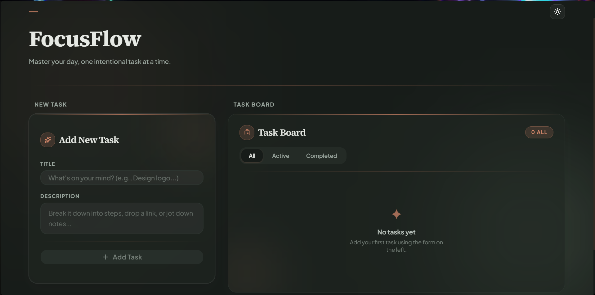

# ✦ FocusFlow

> Master your day, one intentional task at a time. A modern, full-stack todo app — clean UI, optimistic updates, and production-grade architecture.


---

## 📚 Table of Contents

- [Tech Stack](#-tech-stack)
- [Screenshots](#-screenshots)
- [Project Structure](#-project-structure)
- [Getting Started](#-getting-started)
- [Features](#-features)
- [Architecture Overview](#-architecture-overview)
- [Key Dependencies](#-key-dependencies)
- [Author](#-author)

---

## 🚀 Tech Stack

| Layer | Technology |
|---|---|
| **Framework** | [Next.js 16](https://nextjs.org) (App Router) |
| **Database** | [Neon](https://neon.tech) — serverless PostgreSQL |
| **Server Actions** | Next.js Server Actions |
| **Validation** | [Zod](https://zod.dev) |
| **Global State** | [Zustand](https://zustand-demo.pmnd.rs) |
| **Server State** | [TanStack Query v5](https://tanstack.com/query) |
| **UI Components** | [shadcn/ui](https://ui.shadcn.com) (based on Radix UI) |
| **Theming** | [next-themes](https://github.com/pacocoursey/next-themes) |
| **Styling** | Tailwind CSS v4 |
| **Icons** | [Lucide React](https://lucide.dev) |

---

## 📸 Screenshots





---

## 📁 Project Structure

```
nextjs-todo-app/
├── app/
│   ├── actions/
│   │   └── todo-actions.js        # Next.js Server Actions (CRUD)
│   ├── api/
│   │   └── test-db/
│   │       └── route.js           # DB connection test endpoint
│   ├── globals.css                # Global styles + amber theme tokens
│   ├── layout.js                  # Root layout (fonts, providers)
│   └── page.js                    # Home page (form + list layout)
│
├── components/
│   ├── providers/
│   │   ├── query-provider.jsx     # TanStack Query client provider
│   │   └── theme-provider.jsx     # next-themes provider
│   └── ui/
│       ├── button.jsx             # shadcn Button
│       ├── card.jsx               # shadcn Card
│       ├── input.jsx              # shadcn Input
│       ├── textarea.jsx           # shadcn Textarea
│       ├── theme-toggle.jsx       # Light/dark toggle
│       ├── todo-form.jsx          # Add task form
│       └── todo-list.jsx          # Task board with filters
│
├── hooks/
│   ├── use-create-todo.js         # TanStack mutation — create
│   ├── use-delete-todo.js         # TanStack mutation — delete
│   ├── use-get-todos.js           # TanStack query   — fetch all
│   └── use-toggle-todo.js         # TanStack mutation — toggle complete
│
├── lib/
│   ├── db.js                      # Neon SQL connection + todos table schema
│   └── utils.js                   # Shared utility functions
│
├── store/
│   └── todo-store.js              # Zustand global store
│
├── validations/
│   └── todo-schema.js             # Zod validation schema
│
├── .env                           # Environment variables (not committed)
├── eslint.config.mjs
├── next.config.mjs
├── postcss.config.mjs
├── components.json                # shadcn/ui config
└── package.json
```

---

## ⚙️ Getting Started

### 1. Clone the repository

```bash
git clone https://github.com/mhmmdafrizal/FocusFlow-ToDoApp.git
cd FocusFlow-ToDoApp
```

### 2. Install dependencies

```bash
npm install
```

### 3. Set up environment variables

Create a `.env` file in the root with your [Neon](https://neon.tech) connection string:

```env
DATABASE_URL=your_neon_connection_string
```

> `lib/db.js` also falls back to `DATABASE_URL_POOLED`, `POSTGRES_URL_NON_POOLING`, or `POSTGRES_URL`.

### 4. Run the development server

```bash
npm run dev
```

Open [http://localhost:3000](http://localhost:3000) in your browser.

---

## ✨ Features

- ✅ **Create** tasks with title and description
- ✅ **Toggle** completion with optimistic UI updates
- ✅ **Delete** tasks with smooth exit animations
- ✅ **Filter** tasks — All / Active / Completed
- ✅ **Progress bar** showing completion ratio
- ✅ **Server Actions** for type-safe mutations
- ✅ **Zod validation** on both client and server
- ✅ **Zustand** for instant local state sync
- ✅ **TanStack Query** for caching and background refetching
- ✅ **Dark/light theme** toggle via next-themes
- ✅ Warm amber glassmorphism UI with staggered animations

---

## 🗺️ Architecture Overview

```
User Interaction
      │
      ▼
TodoForm / TodoList  ←─── Zustand Store (local UI state)
      │                         ▲
      ▼                         │
TanStack Query Hooks  ──────────┘
(useCreateTodo, useGetTodos, etc.)
      │
      ▼
Next.js Server Actions  ←── Zod Schema Validation
      │
      ▼
Neon Serverless SQL  →  PostgreSQL
```

---

## 📦 Key Dependencies

```json
{
  "next": "^16",
  "react": "19.2",
  "@neondatabase/serverless": "^1.1",
  "zod": "^4",
  "zustand": "^5",
  "@tanstack/react-query": "^5",
  "next-themes": "^0.4",
  "radix-ui": "^1.4",
  "lucide-react": "^0.577",
  "tailwindcss": "^4"
}
```

---

## 🙌 Author

Built by **Muhammad Afrizal** — [@mhmmdafrizal](https://github.com/mhmmdafrizal)

---

> *"Clarity, speed, and flow — task management the modern way."*

---